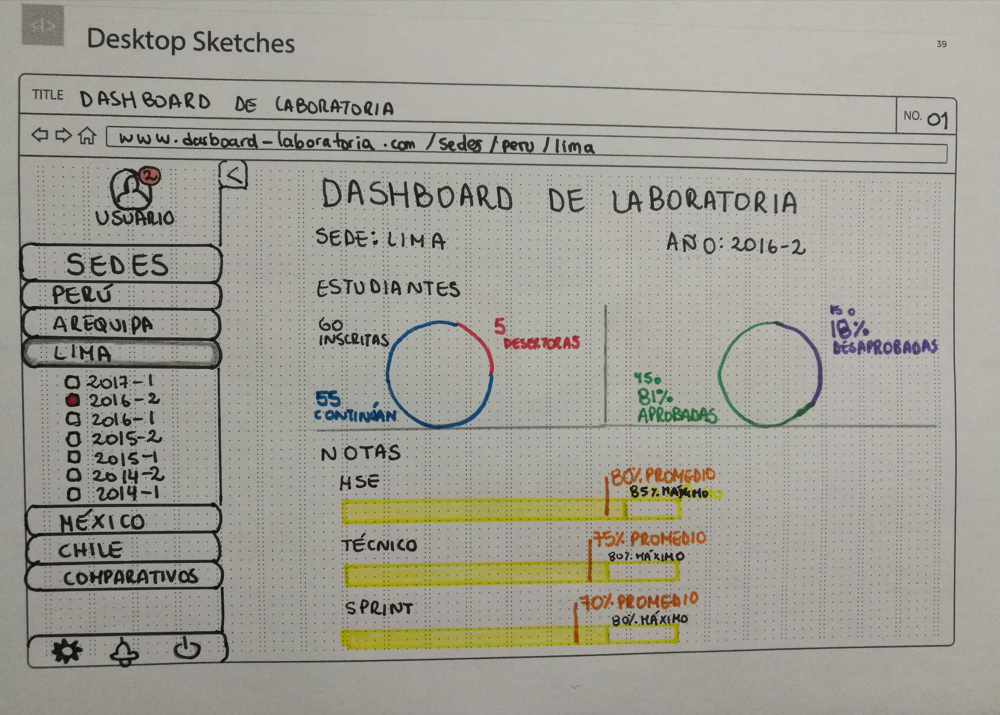
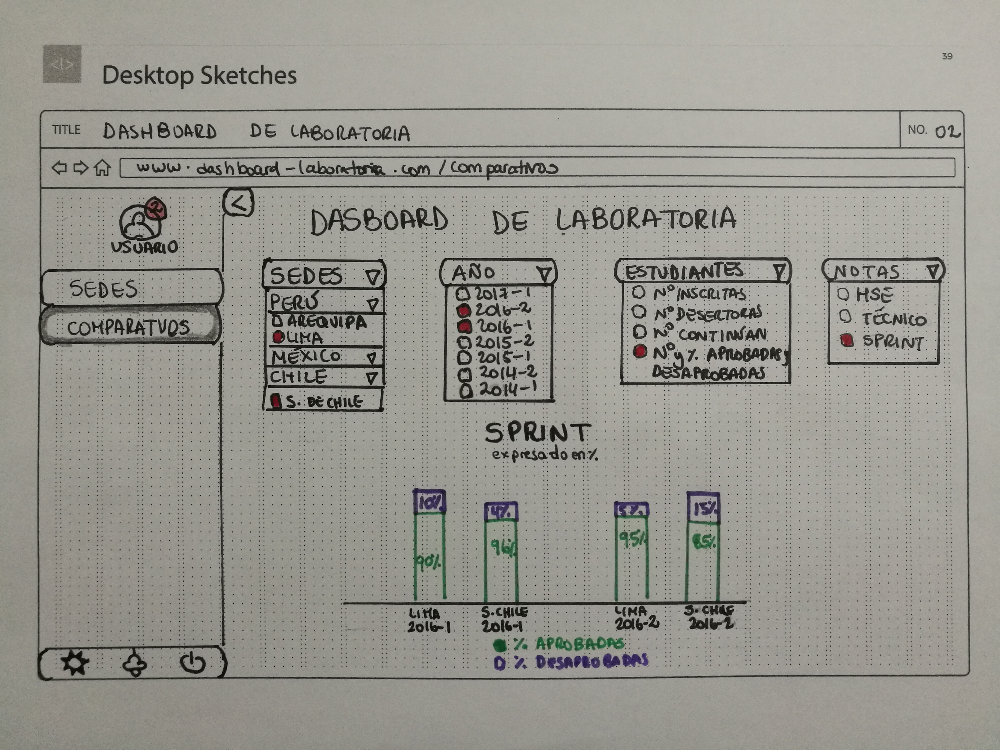

# Draw a dashboard sketch

* **Track:** _Common Core_
* **Course:** _Creating an interactive website with JavaScript_
* **Unid:** _Intro to User Experience Design_

## Objective
---

To draw an sketch for a dashboard for Laboratoria while considering the following: 

The dashboard is a tool used by teachers, training managers, directors and managers of Labotaria to quickly see what's happening in the classroom. In the dashboard, these users can access quickly in real time to stadistics and data such as:

1. Number of registered students
2. Number of deserted students
3. Number and percentage of students who pass the minimum evaluation grade
4. Average grade per Sprint
5. Average Soft Skills grade
6. Average Technical Skills grade

Moreover, Laboratoria has several graduates generations, normally having 2 generations each year starting from 2014 and operating in 4 sites (Arequipa, Mexico City, Lima, Santiago de Chile). User may want to access data of sites and previous generations to make comparisons. 

### Dashboard
#### Dashboard N° 1

In this first part of the dashboard, we can see the following:  

1. A foldable menu on the left with a arrow, containing:
    1. User avatar.
    2. Notifications in the upper side of the user avatar, highlighted with a red background.
    3. Collapsing menu with sites per countries and cities, which are then divided by descending generations taht have a checkbox that turns red when selected.
    4. Icons section at the bottom giving access to user configurations, notifications and log out.
2. Main title in the middle of the page stating: "Dashboard de Laboratoria" (Laboratoria Dashboard).
3. Indication of the site and year displayed.
4. Stadistics on students information and grades, as follows:
    1. In the first part, we can see the students information:
        1. On the left, we can see the total registered students with black font, the total number of deserted students with red font and the remaining students with blue font.
        2. On the right, we can see the number and percentage of graduating students with green font and the number and percentage of failing students with purple font.
    2. In the second part, we can see the drages information:
        1. The first yellow bar shows the maximum and average percentages (with black and orange fonts, respectively) for Soft Skills grade.
        2. The second yellow bar shows the maximum and average percentages (with black and orange fonts, respectively) for Tech Skills grade.
        3. The third yellow bar shows the maximum and average percentages (with black and orange fonts, respectively) for the Sprint.

#### Dashboard N° 2

In this second part of the dashboard, we can see the following:  
1. A foldable menu on the left with a arrow, containing:
    1. User avatar.
    2. Notifications in the upper side of the user avatar, highlighted with a red background.
    3. Collapsing menu with sites per countries and cities, which are then divided by descending generations taht have a checkbox that turns red when selected.
    4. Icons section at the bottom giving access to user configurations, notifications and log out.
2. Main title in the middle of the page stating: "Dashboard de Laboratoria" (Laboratoria Dashboard).
3. A section with four options areas, expalined as follows:
    1. The first area shows a collapsing options section for sites, divided in countries and cities.
    2. The second area shows a collapsing options section for alumni generations years.
    3. The third area shows a collapsing options section for about students: number of registered students, deserted students, graduating students, and the number and percentage        of graduating and failing students. 
    4. The fourth area shows a collapsing option section for grades, according to Soft Skills grades, Technical Skills and Sprint.
4. A section with a stadictic portraying the comparison of the number and percentage of graduating and failing students for the years 2016-1 and 2016-2 from Lima and Santiago de Chile per Sprint grades. In this graphic, we can find a legend stating that graduating students are shown in green and failing students are shown in purple. 

## Outcome

This Sketch was used for testing with Institute's teachers and training managers. The outcome was that the users stated that the information was clear and graphics with colours helped to identify quickly students' information. They also didn't have any problems for navigating through the site, which shows the usability of the prototype.

## Project Content

This project has:

1. One **`README.md`** file explaining the repository content.

2. One `docs` folder for Dashboard images in **jpg** format.

## Author
Lizbeth Felix Pena

## Date
25/11/2017
